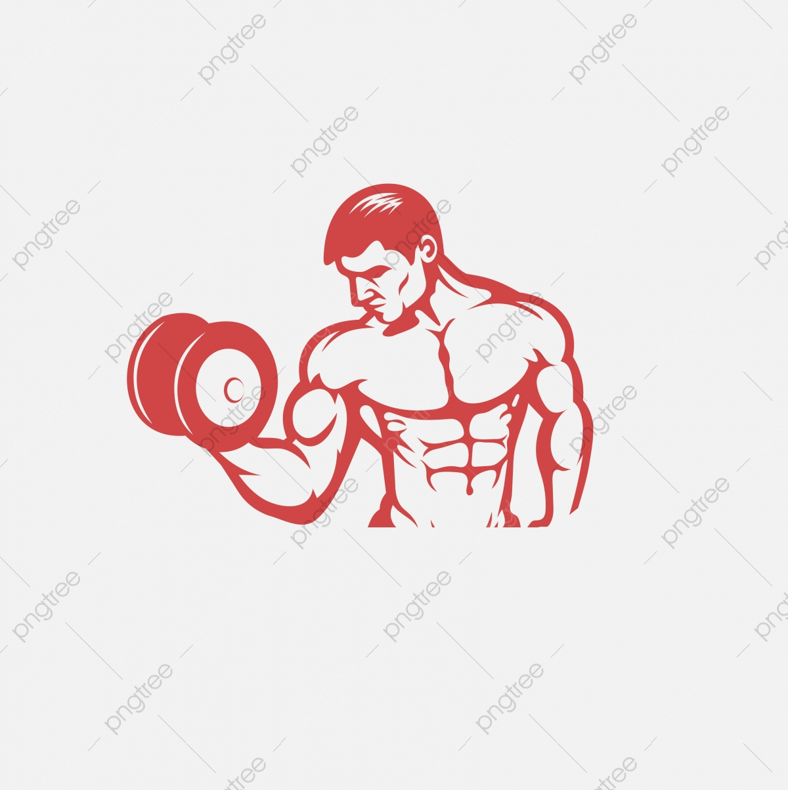

<!DOCTYPE html>
<html lang="en">

<head>
    <meta charset="UTF-8">
    <meta http-equiv="X-UA-Compatible" content="IE=edge">
    <meta name="viewport" content="width=device-width, initial-scale=1.0">
    <title>Mahendra GYM</title>
    
</head>
<link href="https://fonts.googleapis.com/css2?family=Baloo+Tamma+2&display=swap" rel="stylesheet">
<link rel="stylesheet" href="">

<body>
    <header class="header">
        <!-- left box for logo -->
        

            

            
Fitness

        

        <!-- mid box for navbar -->
        

            <ul class="navbar">
                <li><a href="#" class="active">Home</a></li>
                <li><a href="#">service</a></li>
                <li><a href="#">fitness</a></li>
                <li><a href="#" class="active">contact us</a></li>
            </ul>
            <!-- i am mid.... -->
        

        <!-- right box for button -->
        

            <button class="btn">Contact Us</button><button class="btn">Email Us</button>
            <!-- <button id="str">neon button</button> -->
        

        

            <h2>Join the best gym in Luck_Now.....</h2>
            <form action="noaction.php"></form>
            

            <input type="text" name="text" placeholder="Enter your name">
        

            

                            <input type="text" name="text" placeholder="Enter your gender">
        

            

            <input type="text" name="text" placeholder="Enter your age">
        

            

            <input type="text" name="text" placeholder="Enter your locality">
        

        
       <button class="btn1" onclick="myfunction()">Submit Now</button>
       <button class="btn2">Reset Now </button>
       <input class="form-group"type="reset" value="reset now">
        

      

    </header>
</body>
 
</html>
